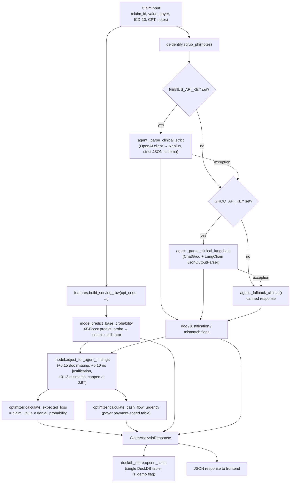

# Architecture

`real-model` branch. This describes what the code actually does, traced from
`main.py` and `scripts/train.py` outward — not the pitch-deck version.

## Folder map

```
ClaimGuard-AI/
├── backend/                  FastAPI app, model serving, agent, storage
│   ├── main.py                API routes; wires model + agent + optimizer + store together
│   ├── agent.py                LLM calls (Groq/Nebius): clinical analysis, appeal letters, policy check
│   ├── model.py                Loads joblib model+calibrator, scores a claim, applies heuristic uplift
│   ├── features.py             Feature engineering shared by training and serving (target encodings)
│   ├── optimizer.py            Expected loss, cash-flow urgency, bounded knapsack queue ordering
│   ├── deidentify.py           Regex PHI scrubber, runs before every LLM call
│   ├── duckdb_store.py         DuckDB schema + CRUD/query for the claims table (the only store)
│   ├── schemas.py              Pydantic request/response models for the API
│   ├── models/                 Committed training artifacts (model, calibrator, feature maps, metrics.json)
│   ├── tests/                  62 pytest tests (see "Test layout" below)
│   ├── requirements.txt
│   └── Dockerfile
├── scripts/
│   ├── train.py                 Downloads CERT 2021-2025, trains, evaluates, writes backend/models/
│   ├── generate_pitch_deck.py    Builds ClaimGuard-AI-Pitch-Deck.pptx (investor deck, python-pptx)
│   └── generate_hackathon_deck.py Builds the original 5-slide hackathon deck
├── frontend/                  Next.js 16 app (App Router)
│   ├── app/page.tsx             Marketing landing page, "Launch Live Demo" seeds demo claims
│   ├── app/dashboard/            Executive KPI overview + top priority claims
│   ├── app/queue/                Auditor worklist: knapsack-ordered table + claim detail drawer
│   ├── app/studio/                "Agent Studio": live note → agent analysis, policy check, appeal draft
│   ├── app/reports/               Charts (Recharts), CSV/PDF export, local claim history
│   ├── app/settings/               Client-only UI state (confidence slider, demo-mode toggle); nothing persists to the backend
│   ├── app/components/             Sidebar, AppShell (layout/nav), NewClaimModal, MetricCard (unused)
│   └── lib/api.ts                 API_URL constant, fetch wrapper, localStorage claim history helpers
├── data/cert/                 CERT CSVs downloaded by scripts/train.py (gitignored, empty until first run)
├── docs/
│   └── PROJECT-NOTES.md         Engineering log for the real-model rebuild
├── .github/workflows/ci.yml   Backend (ruff + pytest) and frontend (npm build) jobs
├── docker-compose.yml          backend (built image) + frontend (node:20-slim dev server)
├── .env.example                 Frontend env var (NEXT_PUBLIC_API_URL); backend/training vars live in backend/.env.example
├── README.md                    Model card, honest limitations, quickstart
├── PROJECT_WRITEUP.md           Original hackathon submission doc (superseded by README; kept for history)
└── wandb/                      Local offline W&B run directory from a past training run (gitignored)
```

## Data flow

### 1. Claim scoring (`POST /api/analyze-claim`)



Key point: `model_base_probability` (pure model output) and `denial_probability`
(after the documented heuristic uplift) are both returned — the API never
conflates a statistical estimate with a business-rule adjustment.

### 2. Queue read (`GET /api/priority-queue`, `GET /api/treasury-priority`)

```
duckdb_store.list_claims()  →  optimizer.prioritize_claims(mode, capacity)
                                  ├─ recompute expected_loss / cash_flow_urgency per claim
                                  ├─ sort by expected_loss_usd or cash_flow_urgency
                                  └─ optimizer.bounded_knapsack_select (0/1 knapsack, value=EL×100, weight=1)
                             →  top N claims, `knapsack_selected` flag set
```

Note: `duckdb_store.query_priority_queue` implements the same ordering as a
SQL query (`ORDER BY expected_loss_usd/cash_flow_urgency DESC`) but is never
called from `main.py` — the API always goes through the Python path in
`optimizer.py`. See CODE-AUDIT.md.

### 3. Training pipeline (`scripts/train.py`)

```mermaid
flowchart LR
    A["CMS CERT CSVs\n2021-2025 (data.cms.gov)"] --> B["load_year()\nrename columns, label = Disagree"]
    B --> C["train_df = 2021+2022+2023\nval_df = 2024\ntest_df = 2025"]
    C --> D["features.fit_feature_maps(train_df)\nsmoothed target rates, m=50, TRAIN ONLY"]
    D --> E["features.apply_features()\non train/val/test"]
    E --> F["LogisticRegression baseline"]
    E --> G["XGBClassifier\n(early stopping on val, aucpr)"]
    G --> H["IsotonicRegression\nfit on val predictions"]
    F --> I["evaluate() on val + test\nROC-AUC, PR-AUC, Brier, log loss,\n10-bin reliability curve"]
    G --> I
    H --> I
    I --> J["backend/models/\ndenial_model.joblib, calibrator.joblib,\nfeature_maps.json, metrics.json"]
    J -.->|"optional"| K["W&B run\n(offline by default)"]
```



## Model card (from `backend/models/metrics.json`, committed run)

| | |
|---|---|
| Dataset | CMS Medicare FFS CERT, report years 2021-2025 (data.cms.gov, public) |
| Label | `Review Decision == "Disagree"` (improper payment on audit) — documented proxy for denial risk |
| Split | Temporal: train 2021-2023 (n=486,684) / val 2024 (n=185,349) / test 2025 (n=163,940) |
| Features (9) | `part_idx, hcpcs_first_idx, has_drg, tob_present, hcpcs_rate, provider_rate, tob_rate, part_rate, hcpcs_freq_log` — all encodings fitted on train years only |
| Model | XGBoost (`n_estimators=600, max_depth=6, lr=0.05`, early stopping at iteration 121) vs. logistic-regression baseline |
| Calibration | Isotonic regression fitted on the 2024 validation predictions |
| Seed | 42, deterministic |
| Trained at (this run) | 2026-07-13T02:14:20Z, Python 3.12.4 |

**Test year 2025 (n=163,940, base rate 14.1%):**

| Model | ROC-AUC | PR-AUC | Brier | Log loss |
|---|---|---|---|---|
| Logistic regression | 0.7400 | 0.2827 | 0.1131 | 0.3687 |
| XGBoost (raw) | 0.7445 | 0.3017 | 0.1108 | 0.3607 |
| **XGBoost + isotonic (served)** | **0.7447** | **0.2949** | **0.1096** | **0.3575** |

**Validation year 2024 (n=185,349, base rate 15.8%), served model:** ROC-AUC 0.7345, PR-AUC 0.3097, Brier 0.1203.

Reliability curves (10 quantile bins per split/model) are in `metrics.json` under `results.<split>[].reliability`.

**Serving-time heuristic (business rule, not model output, in `model.py`):**
`UPLIFT_DOC_MISSING=0.15`, `UPLIFT_NO_JUSTIFICATION=0.10`, `UPLIFT_PROCEDURE_MISMATCH=0.12`,
`PROB_CAP=0.97`, applied additively on top of the calibrated probability when the
LLM agent flags documentation problems. CERT has no chart-note field, so these
flags cannot be trained model features — they're combined post-hoc and reported
as a separate field (`model_base_probability` vs. `denial_probability`).

## Config surface (every env var, from `.env.example`)

| Variable | Consumed by | Default if unset | Effect |
|---|---|---|---|
| `GROQ_API_KEY` | `agent.py` | unset | Enables the LangChain/Groq fallback path for LLM analysis |
| `NEBIUS_API_KEY` | `agent.py` | unset | Enables the primary (tried-first) Nebius path for LLM analysis |
| `NEBIUS_MODEL` | `agent.py` | `google/gemma-3-27b-it` | Model id sent to the Nebius chat completions endpoint |
| `NEBIUS_BASE_URL` | `backend/.env.example` only (hardcoded in `agent.py` as `NEBIUS_BASE_URL` constant, not read from env at runtime) | `https://api.tokenfactory.nebius.com/v1/` | See CODE-AUDIT.md — this var is documented but not actually read by `agent.py` |
| `CORS_ORIGINS` | `main.py` | `http://localhost:3000` | Comma-separated exact-match allowed origins |
| `CORS_ORIGIN_REGEX` | `main.py` | `https://.*\.vercel\.app` | Regex-matched allowed origins (for Vercel preview URLs); Starlette can't exact-match a wildcard, hence the separate regex param |
| `DUCKDB_PATH` | `duckdb_store.py` | `data/claims.duckdb` | Path to the DuckDB file; tests override this per-test via `conftest.py` |
| `MODELS_DIR` | `model.py` | `backend/models` (relative to `model.py`) | Directory containing the committed model artifacts |
| `WANDB_API_KEY` | `scripts/train.py` | unset (→ offline mode) | Syncs training run to Weights & Biases when set |
| `WANDB_PROJECT` | `scripts/train.py` | `claimguard-denial-model` | W&B project name |
| `WANDB_MODE` | `scripts/train.py` | unset | Set to `disabled` to turn off tracking entirely; set to anything to override the offline default |
| `NEXT_PUBLIC_API_URL` | `frontend/lib/api.ts` | `http://localhost:8000` | Backend base URL the frontend fetches against; the only frontend env var, and the only one Next.js will ever expose to client-side code |

Env vars are split into a coherent pair with no overlap: the repo-root
`.env.example` holds only the frontend var (`NEXT_PUBLIC_API_URL`), and
`backend/.env.example` holds the backend + training vars (LLM keys,
`LLM_TIMEOUT`, CORS, `DUCKDB_PATH`, `MODELS_DIR`, W&B). `NEBIUS_BASE_URL` is a
constant in `agent.py`, not an env var, so it is no longer documented as one.

## Test layout (`backend/tests/`, 62 tests)

| File | Covers |
|---|---|
| `conftest.py` | Autouse fixture pointing `DUCKDB_PATH` at a per-test temp file; shared `sample_claim` fixture |
| `test_agent_schema.py` | `ClinicalAnalysis` strict-schema validation, the bool→int/None→""/int→float coercions (regression for the real-LLM-output bug), PHI scrub called before the LLM path |
| `test_api.py` | API routes end-to-end via `TestClient`, with `analyze_clinical_notes` monkeypatched out |
| `test_cors.py` | CORS regression: localhost exact match, Vercel preview regex match, unknown-origin rejection, lookalike-domain rejection (`foo.vercel.app.evil.com`) |
| `test_deidentify.py` | Each PHI pattern (SSN, phone, email, MRN, DOB/dates, names, address/ZIP), clinical-content preservation, empty/None safety |
| `test_model.py` | Committed artifacts load, probability stays in `[0,1]`, unseen CPT codes fall back near the prior, uplift/cap behavior |
| `test_optimizer.py` | Expected-loss arithmetic, cash-flow urgency ordering, risk-level thresholds, knapsack correctness (capacity, value-density, weighted, empty/zero-capacity edge cases) |
| `test_store.py` | DuckDB upsert/get/replace round-trip, `is_demo` persistence, `query_priority_queue` ordering |
| `test_training_pipeline.py` | Feature engineering and a tiny model trained end-to-end on a real 2000-row CERT fixture (`fixtures/cert_sample_2024.csv`), no network required |

Run with `cd backend && pytest tests/ -q` (62 tests, all currently green per
`docs/PROJECT-NOTES.md`). CI (`.github/workflows/ci.yml`) runs `ruff check`
and this test suite on every push/PR to `main`/`real-model`, plus a separate
job that runs `npm run build` for the frontend.
